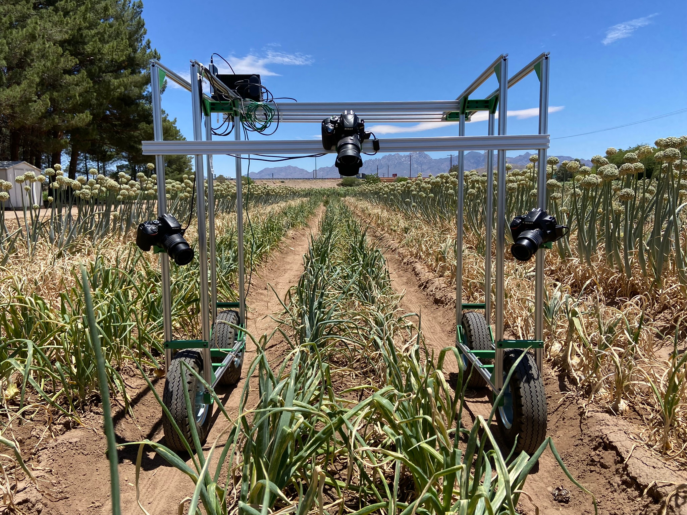

# CameraCart
Camera Cart is a photograph collection system designed for field-scale, close-range plant phenotpying
At the current time this repository is quite messy and undocumented. I will clean up the code files over the next few weeks and provide documentation for building and using the cart.
